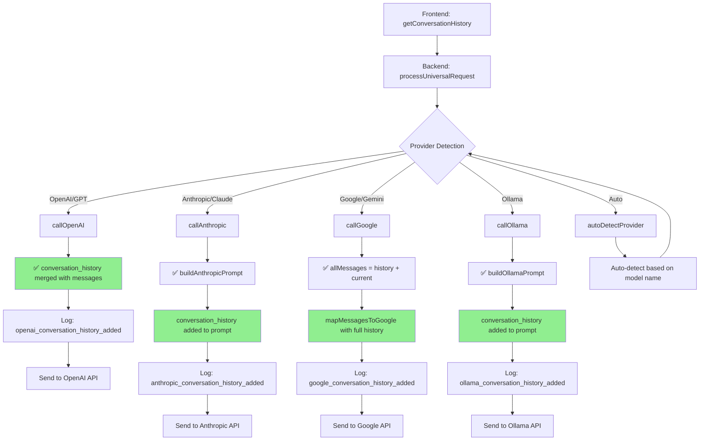

# Processamento de Histórico de Conversas

Este documento explica como o Universal LLM Backend processa e envia o histórico de conversas para diferentes provedores de LLM.

## Visão Geral

O sistema mantém um histórico de conversas que é enviado como contexto para os LLMs, permitindo respostas mais contextualizadas e coerentes durante uma sessão de chat.

## Configuração

### Frontend (JavaScript)

No frontend, configure a janela de contexto em `engine_specific`:

```javascript
engine_specific: {
    provider: 'auto',
    model: 'gemini-2.5-flash-lite',
    dialog_context_window: 5, // Número de mensagens do histórico a incluir
}
```

- **`dialog_context_window`**: Define quantas mensagens do histórico serão incluídas (padrão: 10)
- O frontend busca automaticamente o histórico do bot e formata para o padrão LLM

## Fluxo de Processamento



## Formato do Payload

O frontend envia o histórico no seguinte formato:

```json
{
  "context": {
    "conversation_history": [
      {
        "role": "user", 
        "content": "primeira mensagem do usuário"
      },
      {
        "role": "assistant", 
        "content": "resposta do assistente"
      },
      {
        "role": "user", 
        "content": "segunda mensagem do usuário"
      }
    ]
  }
}
```

## Implementação por Provedor

### OpenAI/GPT
- **Método**: `callOpenAI()`
- **Processamento**: Merge direto do histórico com mensagens atuais
- **Formato**: Array de objetos `{role, content}` 
- **Log**: `openai_conversation_history_added`

```php
if (isset($context['conversation_history']) && !empty($context['conversation_history'])) {
    $openaiParams['messages'] = array_merge($context['conversation_history'], $openaiParams['messages']);
}
```

### Google/Gemini
- **Método**: `callGoogle()`
- **Processamento**: Merge de histórico + mensagens atuais, depois mapeamento para formato Google
- **Formato**: Convertido para `{role: 'user'|'model', parts: [{text}]}`
- **Log**: `google_conversation_history_added`

```php
$allMessages = [];
if (isset($context['conversation_history']) && !empty($context['conversation_history'])) {
    $allMessages = array_merge($allMessages, $context['conversation_history']);
}
$allMessages = array_merge($allMessages, $messages);
$googleParams['contents'] = mapMessagesToGoogle($allMessages);
```

### Anthropic/Claude
- **Método**: `buildAnthropicPrompt()`
- **Processamento**: Histórico incluído no prompt como texto
- **Formato**: Texto estruturado `Human: ... Assistant: ...`
- **Log**: `anthropic_conversation_history_added`

```php
if (isset($context['conversation_history']) && !empty($context['conversation_history'])) {
    foreach ($context['conversation_history'] as $msg) {
        $prompt .= "\n\n" . ucfirst($msg['role']) . ": " . $msg['content'];
    }
}
```

### Ollama
- **Método**: `buildOllamaPrompt()`
- **Processamento**: Histórico incluído no prompt como texto
- **Formato**: Texto estruturado `User: ... Assistant: ...`
- **Log**: `ollama_conversation_history_added`

```php
if (isset($context['conversation_history']) && !empty($context['conversation_history'])) {
    foreach ($context['conversation_history'] as $msg) {
        $prompt .= ucfirst($msg['role']) . ": " . $msg['content'] . "\n";
    }
}
```

## Logging e Debug

Cada provedor registra quando o histórico é processado:

```json
{
  "event": "google_conversation_history_added",
  "details": {
    "provider": "google",
    "model": "gemini-2.5-flash-lite", 
    "history_count": 5,
    "session_id": "session_abc123..."
  }
}
```

## Frontend: Coleta do Histórico

O método `getConversationHistory()` do UniversalLLM.js:

1. **Acessa o histórico do bot**: `this.bot.history`
2. **Filtra mensagens relevantes**: Apenas `input` e `output`
3. **Aplica janela de contexto**: Limita ao `dialog_context_window`
4. **Formata para LLM**: Converte para `{role: 'user'|'assistant', content}`

```javascript
getConversationHistory() {
    const contextWindow = this.bot.options?.engine_specific?.dialog_context_window || 10;
    
    const relevantHistory = this.bot.history.filter(item => {
        const [type] = item;
        return type === 'input' || type === 'output';
    });
    
    const recentHistory = relevantHistory.slice(-contextWindow * 2);
    // ... formatting logic
}
```

## Benefícios

- ✅ **Contexto preservado**: LLMs lembram de conversas anteriores
- ✅ **Respostas coerentes**: Referências a mensagens passadas
- ✅ **Configurável**: Ajuste o tamanho da janela conforme necessário
- ✅ **Multi-provedor**: Funciona com todos os LLMs suportados
- ✅ **Logging completo**: Auditoria e debug facilitados

## Troubleshooting

### LLM não lembra conversas anteriores
- Verifique se `dialog_context_window > 0`
- Confirme que há histórico no `this.bot.history`
- Verifique logs para eventos `*_conversation_history_added`

### Performance impactada
- Reduza `dialog_context_window` 
- Monitore tamanho do payload enviado

### Mensagens malformadas
- Verifique formato do histórico no bot
- Confirme que mensagens têm `content` válido
